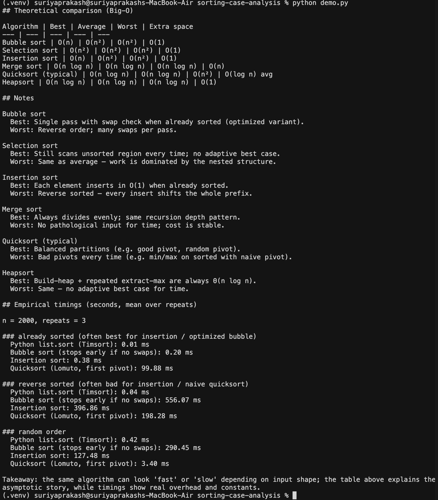

# Sorting: best, worst, and average cases

This project summarizes **asymptotic time complexity** (best, average, and worst cases) for common comparison-based sorting algorithms, and includes a **Python program** (`demo.py`) that prints a reference table and measures run time on three input shapes: already sorted, reverse sorted, and random.

## Setup

Uses Python 3.9+ for the main program. The standard library is enough to run `demo.py`.

```bash
cd sorting-case-analysis
python3 -m venv .venv
source .venv/bin/activate   # Windows: .venv\Scripts\activate
```

## Run

```bash
python demo.py
```

Optional: larger arrays and more repeats (slower):

```bash
python demo.py --n 5000 --repeats 5
```

## Output (screenshots)

Actual terminal output from this project (theory table, notes, and empirical timings). A plain-text example is also in [`docs/sample_output.txt`](docs/sample_output.txt) if you need it for a report.

**Default run — `python demo.py`**



**Larger experiment — `python demo.py --n 5000 --repeats 5`**


*After you change parameters or hardware, capture new screenshots and replace `docs/images/image.png` and `docs/images/image copy.png`, or add new files and update the links above.*

## What “best / average / worst” means

- **Best case**: input shape and model assumptions that minimize work (e.g. already sorted for insertion sort).
- **Average case**: typical random input under the usual model (e.g. random order, all orderings equally likely for quicksort analysis).
- **Worst case**: input that maximizes work (e.g. reverse sorted for naive quicksort with a bad pivot rule).

Constants and cache effects matter in practice; Big-O describes growth as **n** gets large.

## Repository layout

| Path | Purpose |
|------|---------|
| `demo.py` | Entry point: prints theory and runs timing experiments |
| `theory.py` | Data for the Big-O table and notes |
| `docs/sample_output.txt` | Example plain-text output for reports |
| `docs/images/image.png` | Screenshot: default `python demo.py` |
| `docs/images/image copy.png` | Screenshot: `python demo.py --n 5000 --repeats 5` |
| `scripts/generate_readme_images.py` | Optional: synthetic terminal-style PNGs (not used in README) |
