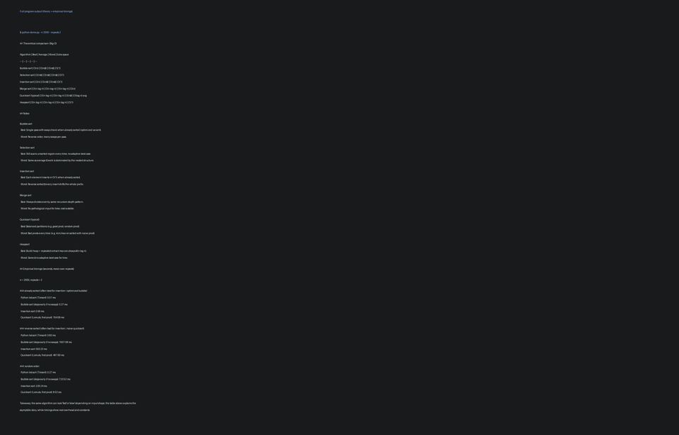
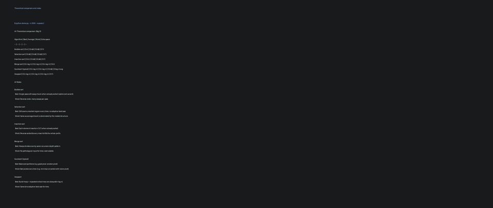
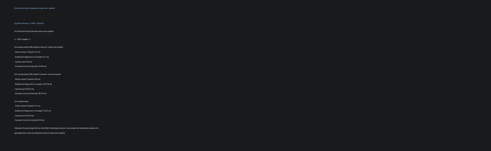

# Sorting: best, worst, and average cases

**College project (faculty submission)**  
Fill in your details below before submitting.

| Field | Your information |
|--------|------------------|
| Student name | *(your name)* |
| Roll / ID | *(your roll number)* |
| Course & semester | *(e.g. Data Structures — Semester III)* |
| Institution | *(your college name)* |
| Submission date | *(date)* |

---

This project summarizes **asymptotic time complexity** (best, average, and worst cases) for common comparison-based sorting algorithms, and includes a **Python program** (`demo.py`) that prints a reference table and measures run time on three input shapes: already sorted, reverse sorted, and random.

## Setup

Uses Python 3.9+ for the main program. The standard library is enough to run `demo.py`.

```bash
cd sorting-case-analysis
python3 -m venv .venv
source .venv/bin/activate   # Windows: .venv\Scripts\activate
```

Optional: to **regenerate** the README screenshots (requires Pillow):

```bash
pip install -r requirements-docs.txt
python scripts/generate_readme_images.py
```

To refresh both the saved text capture and images from a live run:

```bash
python scripts/generate_readme_images.py --from-demo --n 2000 --repeats 2
```

Images are rendered with **supersampling** (draw large, then shrink with high-quality resampling) so text stays sharp in the README and in printed reports. To tweak output:

```bash
# Larger text and wider canvas (good for projectors / A4 print)
python scripts/generate_readme_images.py --font-size 19 --max-width 2200 --min-width 1200

# Even smoother edges (slower, bigger temp canvas): raise supersample to 4
python scripts/generate_readme_images.py --supersample 4
```

## Run

```bash
python demo.py
```

Optional: larger arrays and more repeats (slower):

```bash
python demo.py --n 5000 --repeats 5
```

## Output (screenshots)

The figures below match the saved text output in [`docs/sample_output.txt`](docs/sample_output.txt). You can attach that file or these images to your report for verification.

**Full program output (theory table, notes, and empirical timings)**



**Theoretical comparison (Big-O) and explanatory notes**



**Empirical timings (milliseconds)**



*If you change `demo.py` parameters or the machine, re-run `demo.py` and update `docs/sample_output.txt` and the images using `scripts/generate_readme_images.py`, or replace the PNGs with your own terminal screenshots.*

## What “best / average / worst” means

- **Best case**: input shape and model assumptions that minimize work (e.g. already sorted for insertion sort).
- **Average case**: typical random input under the usual model (e.g. random order, all orderings equally likely for quicksort analysis).
- **Worst case**: input that maximizes work (e.g. reverse sorted for naive quicksort with a bad pivot rule).

Constants and cache effects matter in practice; Big-O describes growth as **n** gets large.

## Repository layout

| Path | Purpose |
|------|---------|
| `demo.py` | Entry point: prints theory and runs timing experiments |
| `theory.py` | Data for the Big-O table and notes |
| `docs/sample_output.txt` | Plain-text output for reports / plagiarism checks |
| `docs/images/*.png` | Screenshots referenced above |
| `scripts/generate_readme_images.py` | Regenerate PNGs from `sample_output.txt` or a live run |
